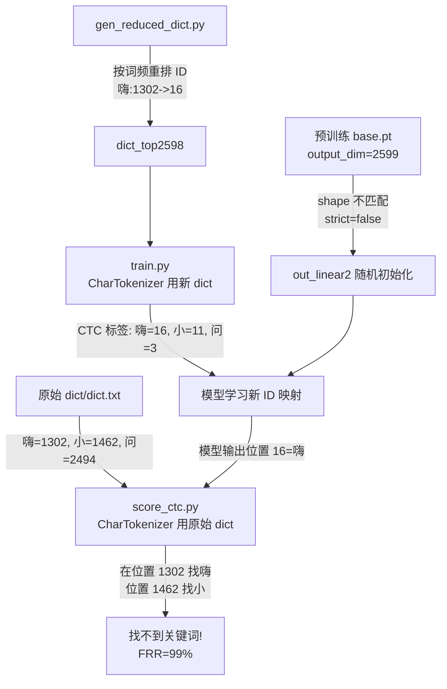

# dict_top2598 模型效果急剧下降根因分析与修复方案

## 一、问题现象

| 实验 | num_keywords | checkpoint_strict | FRR (嗨小问) |

|---|---|---|---|

| baseline_4gpus | 2599 | true (默认) | 3.04% |

| top2599 | 2599 | true | 3.90% |

| **top2598** | **2598** | **false** | **98.88%** |

| **top440** | **442** | **false** | **99.00%** |

## 二、根因：三重不一致

问题的核心是 **token-to-ID 映射** 在训练、预训练模型、评测三处完全不一致。

### 2.1 gen_reduced_dict.py 对 token ID 做了全量重排

[`tools/gen_reduced_dict.py`](tools/gen_reduced_dict.py) 按词频排序后从 ID=2 开始重新编号：

```134:146:tools/gen_reduced_dict.py
    with open(dict_path, "w", encoding="utf8") as f:
        f.write("sil 0\n")
        f.write("<eps> -1\n")
        f.write("<blk> 0\n")
        f.write("<filler> 1\n")
        next_id = 2
        for tok in selected:
            if tok in SPECIAL_TOKENS:
                continue
            f.write(f"{tok} {next_id}\n")
            next_id += 1
```

这导致相同 token 在原始 dict 和新 dict 中拥有**完全不同的 ID**：

| Token | 原始 dict ID | dict_top2598 ID |

|-------|-------------|-----------------|

| 嗨    | **1302**    | **16**          |

| 小    | **1462**    | **11**          |

| 问    | **2494**    | **3**           |

| 的    | 2018        | 2               |

### 2.2 训练使用新 dict，评测使用原始 dict

**训练阶段** ([`wekws/bin/train.py`](wekws/bin/train.py) 117-123 行)：

```python
tokenizer = CharTokenizer(f'{args.dict}/dict.txt', ...)  # 使用 dict_top2598
```

模型学到的是：嗨→位置16，小→位置11，问→位置3。

**评测阶段** ([`run_fsmn_ctc.sh`](examples/hi_xiaowen/s0/run_fsmn_ctc.sh) 246-256 行)：

```bash
python wekws/bin/score_ctc.py \
    --config $dir/config.yaml \
    # 注意: 没有传 --dict $dict_dir！使用默认值 ./dict（原始词表）
    --token_file data/tokens.txt \
    --lexicon_file data/lexicon.txt
```

`score_ctc.py` 的 `--dict` 默认为 `./dict`（原始词表），所以评测时把关键词 "嗨小问" 映射为原始 ID (1302, 1462, 2494)。然后在 CTC prefix beam search 中去模型输出的第 1302、1462、2494 位置找关键词——但模型把"嗨小问"放在了第 16、11、3 位置。**评测永远找不到关键词**。

[`evaluate.sh`](examples/hi_xiaowen/s0/evaluate.sh) 同理，`dict_dir` 默认也是 `"dict"`。

### 2.3 输出层随机初始化（雪上加霜）

当 `num_keywords` 从 2599 变为 2598 时，输出层 `out_linear2` 形状不匹配（2599 vs 2598），`checkpoint_strict=false` 导致：

```
WARNING Checkpoint: skipped mismatched keys: ['backbone.out_linear2.linear.weight', 'backbone.out_linear2.linear.bias']
WARNING Checkpoint: missing keys: ['backbone.out_linear2.linear.weight', 'backbone.out_linear2.linear.bias']
```

输出层被**随机初始化**，预训练模型在分类头上的知识完全丢失。虽然特征提取层仍然是预训练权重，但分类头必须从零学起，且学习目标是错乱的新 ID 映射。

### 2.4 为什么 top2599 (strict=true) 看起来正常？

- `num_keywords=2599` 与预训练模型一致，输出层权重**完整加载**
- 虽然训练用的 dict_top2599 也有 ID 重排，但训练只跑了约 4 个 epoch，模型权重几乎没变
- 评测用原始 dict，与预训练输出层一致，所以关键词仍能被检出
- **警告：如果 top2599 训练足够多 epoch（如 80），输出层会逐渐学习新的 ID 映射，评测同样会失效！**

## 三、问题总结流程图



## 四、修复方案

需要同时修复**两个问题**：(1) 训练-评测 dict 不一致；(2) 输出层初始化。

### 方案 A：保持 ID 映射一致（推荐，改动最小）

1. **修改 `gen_reduced_dict.py`**：保留原始 token ID，不做重排。从原始 dict 中筛选 top-N 高频 token，保持其原始 ID 不变。输出的 dict.txt 中 ID 仍然从 0 连续编号，但**排列顺序与原始 dict 一致**（而非按词频）。
2. **修改评测脚本**：`run_fsmn_ctc.sh` Stage 3 和 `evaluate.sh` 传入正确的 `--dict $dict_dir`，确保训练和评测使用同一套 dict。

### 方案 B：权重手术（如需真正缩小输出维度）

1. 选择 top-N token，生成**保留原始 ID 顺序**的新 dict（ID 重新编号为 0..N-1，但 token 按原始 ID 升序排列）
2. 写一个权重裁剪脚本：从预训练 `out_linear2` 中，**只复制被保留 token 对应行的权重**到新的小输出层
3. 用裁剪后的 checkpoint 继续 finetune

### 方案 C：保持 output_dim=2599 不变（最简单）

- 不改 `num_keywords`，始终用 2599
- 仅在 dict 中删除低频 token（映射到 `<filler>`）
- 输出层完整加载预训练权重，无需任何 weight surgery
- 缺点：不能真正缩小模型

## 五、立即可做的验证

不改任何代码，用已有的 top2598 模型做一次评测，**把 `--dict` 改成 `dict_top2598`**：

```bash
cd examples/hi_xiaowen/s0
bash evaluate.sh --checkpoint exp/fsmn_ctc_top2598/avg_30.pt \
    --dict_dir dict_top2598 --dataset test --gpu 0
```

如果 FRR 明显下降（虽然不会降到 3%，因为输出层是随机初始化再训练的），就确认了 dict 不一致是主因。