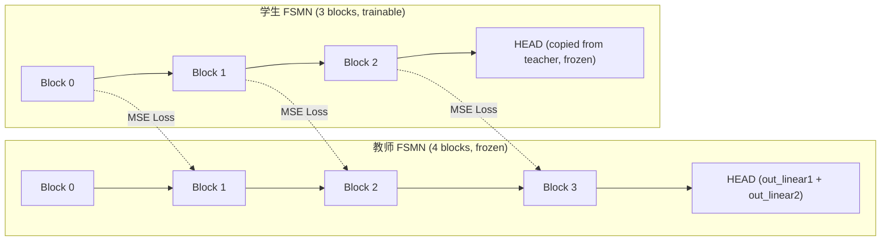

# Block-Level Feature Alignment Distillation with Frozen HEAD

## 问题分析

当前蒸馏方案使用输出层 KL 散度 + CTC loss，但学生网络精度很低。根因：

- 输出层（HEAD）随机初始化后判别力不足（详见 `docs/hi_xiaowen_top2598_analysis.md` 第 9.2 节）
- 输出层 KD 信号太弱，学生学不到足够好的特征表示
- 预训练模型的 HEAD 极其重要，现有数据无法从零训练好 HEAD

## 核心思路

**让学生 backbone 学习教师 backbone 的中间特征，然后直接复用教师的 HEAD（out_linear1 + out_linear2）。**

层映射关系（0-indexed）：

- Student block 0 output (250-dim) --- MSE ---> Teacher block 1 output (250-dim)
- Student block 1 output (250-dim) --- MSE ---> Teacher block 2 output (250-dim)
- Student block 2 output (250-dim) --- MSE ---> Teacher block 3 output (250-dim)




## 学生网络结构调整

**关键变更**：学生的 `linear_dim` 必须改为 250，`output_affine_dim` 改为 140，以匹配教师的 FSMN block 输出维度和 HEAD 输入维度，从而直接复用教师 HEAD。

修改 [conf/fsmn_ctc_student_mini.yaml](examples/hi_xiaowen/s0/conf/fsmn_ctc_student_mini.yaml)：

```yaml
model:
    input_dim: 400
    hidden_dim: 64
    backbone:
        type: fsmn
        input_affine_dim: 96      # 保持小（教师=140）
        num_layers: 3             # 保持 3 层（教师=4 层）
        linear_dim: 250           # 96->250，匹配教师 block 输出维度
        proj_dim: 64              # 保持小（教师=128）
        left_order: 10
        right_order: 2
        left_stride: 1
        right_stride: 1
        output_affine_dim: 140    # 96->140，匹配教师 out_linear1
    training_config:
        max_epoch: 120            # 100 对齐 + 20 微调
```

**参数量估算**：

- in_linear1 (400->96): 38,496
- in_linear2 (96->250): 24,250
- 3x FSMN block (250/64): 99,054
- out_linear1 (250->140, from teacher): 35,140
- **Backbone 总计: ~197K** (< 200K)
- HEAD (out_linear2, from teacher): 取决于教师词表大小

## 训练策略：两阶段

### Phase 1: 纯特征对齐（Epoch 0-99，共 100 epoch）

- **Loss**: 仅 MSE loss（3 组 block 对齐的平均 MSE）
- **HEAD**: 冻结（out_linear1 + out_linear2 的 requires_grad=False）
- **学习率**: 0.001，ReduceLROnPlateau
- **目标**: 让学生 backbone 学会产生与教师相同的中间特征

### Phase 2: 解冻 HEAD 微调（Epoch 100-119，共 20 epoch）

- **Loss**: alpha * MSE + (1-alpha) * CTC，alpha 从 0.5 线性衰减到 0.1
- **HEAD**: 解冻，但使用极低学习率（backbone_lr * 0.01）
- **学习率**: 使用参数组实现差异化 lr
- **目标**: 用 CTC loss 微调整体模型，HEAD 仅做微小适配

## 支持不同教师模型

脚本需支持三类教师：

- `exp/fsmn_ctc_top20_weight_surgery/79.pt` (V=20, dict=dict_top20)
- `exp/fsmn_ctc_top440_weight_surgery/79.pt` (V=440, dict=dict_top440)
- `exp/fsmn_ctc_baseline_4gpus/79.pt` (V=2599, dict=dict)

教师的 backbone 结构完全相同（4 blocks, 250/128），仅 out_linear2 维度不同。学生的 output_dim 自动跟随教师的 output_dim。

## 需要修改的文件

### 1. [wekws/model/fsmn.py](wekws/model/fsmn.py) - FSMN 类

在 `FSMN` 类中添加 `forward_with_block_outputs()` 方法，返回每个 FSMN block 的输出特征列表：

```python
def forward_with_block_outputs(self, input, in_cache=None):
    # ... 与 forward 相同的前处理 ...
    block_outputs = []
    for layer, module in enumerate(self.fsmn):
        x4, in_cache[layer] = module((x4, in_cache[layer]))
        block_outputs.append(x4.clone())  # 250-dim
    # ... out_linear1, out_linear2 ...
    return x7, cache, block_outputs
```

### 2. [wekws/model/kws_model.py](wekws/model/kws_model.py) - KWSModel 类

添加 `forward_with_block_outputs()` 方法，透传到 backbone：

```python
def forward_with_block_outputs(self, x, in_cache=...):
    if self.global_cmvn is not None:
        x = self.global_cmvn(x)
    x = self.preprocessing(x)
    x, out_cache, block_outputs = self.backbone.forward_with_block_outputs(x, in_cache)
    x = self.classifier(x)
    x = self.activation(x)
    return x, out_cache, block_outputs
```

### 3. [wekws/utils/executor_distill.py](wekws/utils/executor_distill.py) - 训练执行器

大幅重写，将 KL 散度替换为 block-level MSE：

- 新增 `block_mse_loss()` 静态方法：计算 3 组 block 对齐的平均 MSE
- 修改 `train()` 方法：Phase 1 使用纯 MSE，Phase 2 使用 MSE + CTC
- 修改 `cv()` 方法：同步支持新 loss 计算
- 新增 layer_mapping 参数：`[(0,1), (1,2), (2,3)]`（student_idx, teacher_idx）

### 4. [wekws/bin/train_distill.py](wekws/bin/train_distill.py) - 训练主脚本

大幅重写训练逻辑：

- 移除旧的 KD 参数（temperature, lambda 等）
- 新增参数：`--align_epochs 100`、`--finetune_epochs 20`、`--head_lr_ratio 0.01`、`--finetune_mse_weight_start 0.5`、`--finetune_mse_weight_end 0.1`
- HEAD 初始化：自动从教师复制 `out_linear1` + `out_linear2` 到学生
- Phase 控制：epoch < align_epochs 时冻结 HEAD，之后解冻并重建 optimizer
- 差异化学习率：backbone 正常 lr，HEAD 使用 lr * head_lr_ratio
- 自动从教师 config 读取 output_dim，确保与 `--num_keywords` 一致

### 5. [examples/hi_xiaowen/s0/run_distill.sh](examples/hi_xiaowen/s0/run_distill.sh) - 蒸馏脚本

更新参数和调用方式：

- 移除旧参数（kd_temperature, kd_lambda_*）
- 新增参数：align_epochs, finetune_epochs, head_lr_ratio
- 用法示例支持不同教师模型
- 默认参数：align_epochs=100, finetune_epochs=20, head_lr_ratio=0.01

### 6. [examples/hi_xiaowen/s0/conf/fsmn_ctc_student_mini.yaml](examples/hi_xiaowen/s0/conf/fsmn_ctc_student_mini.yaml)

更新学生网络结构：

- `linear_dim`: 160 -> 250
- `output_affine_dim`: 96 -> 140
- `max_epoch`: 80 -> 120

