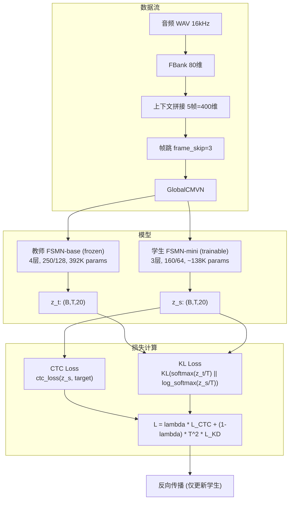

# FSMN+CTC 知识蒸馏实现规划

## 背景

- **教师模型**: `exp/fsmn_ctc_top20_weight_surgery/79.pt`，backbone 389K + head 2.8K = 392K 参数，output_dim=20
- **学生模型**: FSMN-mini，backbone ~136K + head ~1.9K = ~138K 参数，output_dim=20（与教师一致）
- **损失函数**: L = lambda * L_CTC + (1-lambda) * T^2 * KL(p_t^T || p_s^T)
- **训练策略**: 分阶段 lambda 调整 + 纯 CTC 收尾

## 学生网络参数对比

| 参数 | 教师 (top20) | 学生 (mini) |

|------|-------------|-------------|

| num_layers | 4 | 3 |

| linear_dim | 250 | 160 |

| proj_dim | 128 | 64 |

| input_affine_dim | 140 | 96 |

| output_affine_dim | 140 | 96 |

| output_dim | 20 | 20 |

| 预估参数量 | ~392K | ~138K |

## 需要新建的文件（共 4 个）

### 1. 学生网络配置文件

**文件**: [`examples/hi_xiaowen/s0/conf/fsmn_ctc_student_mini.yaml`](examples/hi_xiaowen/s0/conf/fsmn_ctc_student_mini.yaml)

与教师的 config.yaml 结构一致，仅修改 backbone 参数：

```yaml
model:
  input_dim: 400
  output_dim: 20  # 与教师一致
  hidden_dim: 64  # 对应 proj_dim
  preprocessing:
    type: none
  backbone:
    type: fsmn
    input_affine_dim: 96
    num_layers: 3
    linear_dim: 160
    proj_dim: 64
    left_order: 10
    right_order: 2
    left_stride: 1
    right_stride: 1
    output_affine_dim: 96
  classifier:
    type: identity
    dropout: 0.1
  activation:
    type: identity
```

dataset_conf、optim_conf、training_config 保持与教师 config 一致（80 fbank, frame_skip=3, context expansion 等）。

### 2. 蒸馏训练 Executor

**文件**: [`wekws/utils/executor_distill.py`](wekws/utils/executor_distill.py)

核心逻辑（新建，不修改原 `executor.py`）：

- `DistillExecutor.train()`:

  1. 教师模型 `eval()` + `torch.no_grad()` 前向得到 `z_t (B,T,V=20)`
  2. 学生模型 `train()` 前向得到 `z_s (B,T,V=20)`
  3. 计算 CTC loss: `ctc_loss(z_s, target, ...)`
  4. 计算 KL loss: 按有效帧 mask，`KL(softmax(z_t/T) || log_softmax(z_s/T))`
  5. 组合: `loss = lambda * loss_ctc + (1-lambda) * T^2 * loss_kd`
  6. lambda 调度：由 `train_distill.py` 根据 epoch 传入

- `DistillExecutor.cv()`:
  - 只对学生模型做验证（CTC loss + acc），与原始逻辑一致
  - 额外记录 KD loss 供参考

KL loss 的帧 mask 实现：

```python
# mask: (B, T) -> (B, T, 1)
mask = torch.arange(z_s.size(1), device=z_s.device).unsqueeze(0) < feats_lengths.unsqueeze(1)
mask = mask.unsqueeze(-1).float()

log_p_s = F.log_softmax(z_s / T, dim=-1)
p_t = F.softmax(z_t / T, dim=-1)

loss_kd = (F.kl_div(log_p_s, p_t, reduction='none') * mask).sum() / mask.sum()
```

### 3. 蒸馏训练入口脚本

**文件**: [`wekws/bin/train_distill.py`](wekws/bin/train_distill.py)

基于 [`wekws/bin/train.py`](wekws/bin/train.py) 的结构，关键差异：

- 新增命令行参数：
  - `--teacher_checkpoint`: 教师模型 checkpoint 路径（必选）
  - `--teacher_config`: 教师模型 config.yaml 路径（从 teacher_checkpoint 同目录自动推导，也可手动指定）
  - `--kd_temperature`: 温度 T，默认 2.0
  - `--kd_lambda_init`: 初始 lambda，默认 0.7
  - `--kd_lambda_final`: 后期 lambda，默认 0.5
  - `--kd_lambda_switch_epoch`: lambda 切换的 epoch，默认 20
  - `--finetune_epochs`: 纯 CTC 收尾的 epoch 数，默认 10（在 max_epoch 的最后 N epoch 去掉 KD）

- 训练流程：

  1. 加载教师模型（从 teacher config 创建模型 + 加载权重），冻结参数，设为 eval
  2. 创建学生模型（从学生 config），支持可选的 student checkpoint 继续训练
  3. 两模型放到同一 GPU
  4. 训练循环中根据 epoch 计算当前 lambda：

     - epoch < kd_lambda_switch_epoch: lambda = kd_lambda_init (0.7)
     - kd_lambda_switch_epoch <= epoch < (max_epoch - finetune_epochs): lambda = kd_lambda_final (0.5)
     - epoch >= (max_epoch - finetune_epochs): lambda = 1.0（纯 CTC）

  1. 使用 `DistillExecutor` 进行训练和验证

- 教师模型加载方式：直接用 `init_model()` + `torch.load()` state_dict，无需 DDP 包装

### 4. 蒸馏运行脚本

**文件**: [`examples/hi_xiaowen/s0/run_distill.sh`](examples/hi_xiaowen/s0/run_distill.sh)

Shell 脚本，支持以下参数（通过 `parse_options.sh`）：

- `--teacher_checkpoint`: 默认 `exp/fsmn_ctc_top20_weight_surgery/79.pt`
- `--student_config`: 默认 `conf/fsmn_ctc_student_mini.yaml`
- `--target_exp_dir`: 默认 `exp/fsmn_ctc_distill_mini`
- `--num_keywords`: 默认 20
- `--dict_dir`: 默认 `dict_top20`
- `--gpus`: 默认 `"0,1,2,3"`
- `--kd_temperature`: 默认 2.0
- `--kd_lambda_init / --kd_lambda_final / --kd_lambda_switch_epoch`
- `--finetune_epochs`

包含两个 stage：

- **Stage 2**: 蒸馏训练（调用 `wekws/bin/train_distill.py`）
- **Stage 3**: 模型平均 + 评测（复用现有 `wekws/bin/average_model.py`、`score_ctc.py`、`compute_det_ctc.py`）

日志机制与 `run_fsmn_ctc.sh` 一致（tee 到日志文件）。

## 数据流和训练流程图



## Lambda 调度策略

```mermaid
gantt
    title Lambda 调度 (max_epoch=80, finetune_epochs=10)
    dateFormat X
    axisFormat %s

    section KD阶段1
    lambda=0.7 (CTC主导+KD辅助) : 0, 20

    section KD阶段2
    lambda=0.5 (CTC与KD平衡) : 20, 70

    section 收尾阶段
    lambda=1.0 (纯CTC微调) : 70, 80
```



## 不修改的现有文件

- `wekws/bin/train.py` - 不动
- `wekws/utils/executor.py` - 不动
- `wekws/model/loss.py` - 不动（复用其中的 `ctc_loss` 函数）
- `wekws/model/fsmn.py` - 不动（学生模型直接用 FSMN 类，只是参数更小）
- `wekws/model/kws_model.py` - 不动（复用 `init_model` 创建教师和学生模型）
- `run_fsmn_ctc.sh` - 不动
- `evaluate.sh` - 不动（蒸馏后直接用它评测学生模型）