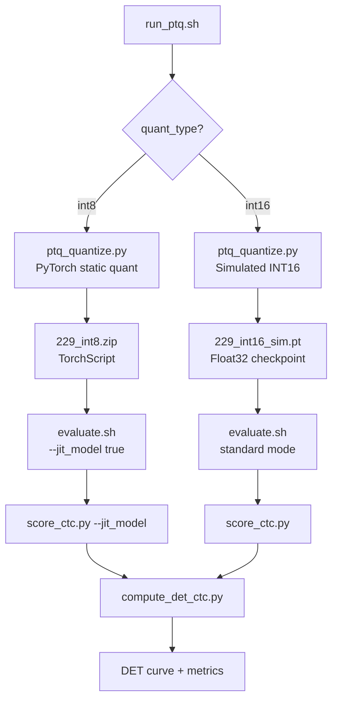

# PTQ Quantization Support

## Background

The distilled model (199K params) at `exp/fsmn_ctc_distill_mini_align_20_test2/` needs PTQ quantization for edge deployment. The FSMN model already has `QuantStub`/`DeQuantStub` in `LinearTransform`, `AffineTransform`, `FSMNBlock` ([wekws/model/fsmn.py](wekws/model/fsmn.py)), and `score_ctc.py` already supports `--jit_model` for TorchScript loading (line 243).

## Strategy

- **INT8**: PyTorch static quantization (qnnpack) -> TorchScript `.zip` -> evaluate via `--jit_model`
- **INT16**: Simulated quantization (weights quantize-dequantize to 16-bit precision, stored as float32 `.pt`) -> evaluate directly with existing evaluate.sh (no special flag needed)
- Calibration data: subsample N samples from existing `data/train/data.list` or `data/dev/data.list`

## Files to Create

### 1. `wekws/bin/ptq_quantize.py` - Core PTQ engine

Key arguments:

- `--config`: model config.yaml
- `--checkpoint`: source .pt checkpoint
- `--calib_data`: data.list file for calibration (default `data/train/data.list`)
- `--num_calib`: number of calibration samples (default 200)
- `--quant_type`: `int8` or `int16`
- `--output_dir`: output directory (default: same dir as checkpoint)
- `--dict`: dict directory

**INT8 flow:**

1. `init_model()` -> `load_checkpoint()` -> `eval()`
2. `model.fuse_modules()`
3. `qconfig = get_default_qconfig('qnnpack')`
4. `prepare()` -> calibrate with data -> `convert()`
5. `torch.jit.script()` -> save as `<basename>_int8.zip`
6. Report FP32 vs INT8 model size

**INT16 flow (simulated):**

1. `init_model()` -> `load_checkpoint()` -> `eval()`
2. Calibrate: run data through model to collect per-layer activation min/max
3. For each weight tensor: `scale = max(|W|) / 32767`; `W = round(W / scale) * scale`
4. Save state_dict as `<basename>_int16_sim.pt`
5. Report estimated size reduction (original_params * 2 bytes / original_params * 4 bytes)

Note: the existing `static_quantize.py` has a subtle issue where `model_fp32_prepared(feats)` doesn't unpack the `(logits, out_cache)` tuple. The new script will handle this correctly.

### 2. `examples/hi_xiaowen/s0/run_ptq.sh` - Shell wrapper script

Follows the same pattern as `run_fsmn_ctc.sh` / `run_distill.sh`:

- Uses `parse_options.sh` for argument parsing
- Auto logging to `<output_dir>/logs/`
- Two stages:
  - **Stage 1**: PTQ quantization (calls `ptq_quantize.py`)
  - **Stage 2**: Evaluation (calls `evaluate.sh` with appropriate flags)

Key parameters:

- `--checkpoint`: source model (e.g. `exp/fsmn_ctc_distill_mini_align_20_test2/229.pt`)
- `--quant_type`: `int8` or `int16` (default `int8`)
- `--num_calib`: calibration sample count (default 200)
- `--calib_data`: calibration data file (default `data/train/data.list`)
- `--dict_dir`: vocabulary dict (default `dict_top20`)
- `--gpu`: GPU id

## Files to Modify (Minimal, Backward-Compatible)

### 3. `examples/hi_xiaowen/s0/evaluate.sh` - Add `--jit_model` flag

Add one optional parameter (default `false`), zero impact on existing usage:

```bash
jit_model=false    # <-- new, default false

# ... in score_ctc.py call, add:
jit_opt=""
if [ "$jit_model" = "true" ]; then
    jit_opt="--jit_model"
fi
# pass $jit_opt to python wekws/bin/score_ctc.py
```

All existing `evaluate.sh` invocations remain unchanged.

### 4. `docs/常用命令.txt` - Add PTQ commands section

Add a `# PTQ量化` section at the end with example commands:

```bash
# PTQ量化
bash ./run_ptq.sh --checkpoint exp/fsmn_ctc_distill_mini_align_20_test2/229.pt --quant_type int8 --dict_dir dict_top20 1 2
bash ./run_ptq.sh --checkpoint exp/fsmn_ctc_distill_mini_align_20_test2/229.pt --quant_type int16 --dict_dir dict_top20 1 2
```

## Evaluation Flow




## Key Design Decisions

- **No changes to model code**: The FSMN model already has full quantization support (QuantStub/DeQuantStub/fuse_modules)
- **No changes to score_ctc.py**: Already has `--jit_model` flag
- **Minimal evaluate.sh change**: One new optional parameter that defaults to existing behavior
- **INT16 as simulation**: PyTorch lacks native INT16 quantization; simulated approach is standard for accuracy evaluation. For actual INT16 deployment, use `export_onnx.py` + ONNX Runtime quantization separately
- **Calibration data**: Subsample from existing prepared data (data.list format), no new data preparation needed

