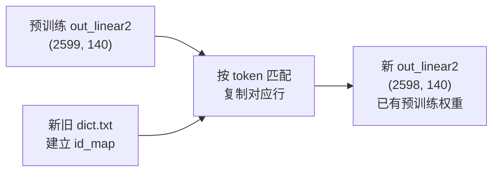

# 实现输出层权重手术

## 核心思路

当 `checkpoint_strict=false` 且 `out_linear2` 形状不匹配时，不再随机初始化输出层，

而是通过比对新旧 dict.txt 中的 token 文本建立 `new_id -> old_id` 映射，

从预训练权重中复制对应行。



例如 token `嗨` 在原始 dict 中 ID=1302、在 dict_top2598 中 ID=16，

则将预训练权重的第 1302 行复制到新输出层的第 16 行。

## 兼容性设计

- `--checkpoint_dict` 默认值为 `"dict"`（原始词表目录），覆盖所有已有实验
- `checkpoint_strict=true` 时完全不走权重手术路径，不影响 baseline / top2599 等实验
- `checkpoint_strict=false` 且形状匹配时（如 top2599 strict=false），也不触发手术
- 权重手术**仅在 strict=false 且形状不匹配时自动触发**，即 top2598 / top440 等场景

已有的 6 条命令（常用命令.txt）全部无需修改即可正常运行。

## 改动文件（共 3 个）

### 1. [`wekws/utils/checkpoint.py`](wekws/utils/checkpoint.py) -- 核心逻辑

在 `load_checkpoint` 函数中增加权重手术：

- 新增辅助函数 `_parse_dict(path)`: 解析 dict.txt，返回 `{token: id}` 映射（仅 id>=0）
- 新增辅助函数 `_build_id_map(old_dict_path, new_dict_path)`: 比对两份 dict，返回 `{new_id: old_id}` 映射
- 修改 `load_checkpoint` 签名，增加 `old_dict_dir=None, new_dict_dir=None`
- 在 `not strict` 分支中，对 `mismatched` 列表里包含 `out_linear2` 的 key：
  - 如果 `old_dict_dir` 和 `new_dict_dir` 均可用且不同，构建 id_map
  - 创建新参数（与模型 state_dict 同 shape），逐行从预训练权重复制
  - 将手术后的参数加入 `filtered`，从 `mismatched` 移除
  - 日志记录手术结果（复制了多少行、总行数）

关键伪代码：

```python
def load_checkpoint(model, path, strict=True,
                    old_dict_dir=None, new_dict_dir=None):
    # ... 现有加载逻辑 ...
    if not strict:
        # ... 现有 shape 过滤逻辑 ...

        # 权重手术：对 out_linear2 的 mismatched keys
        if (old_dict_dir and new_dict_dir
                and old_dict_dir != new_dict_dir):
            id_map = _build_id_map(
                os.path.join(old_dict_dir, 'dict.txt'),
                os.path.join(new_dict_dir, 'dict.txt'))
            for k in list(mismatched):
                if 'out_linear2' not in k:
                    continue
                old_param = checkpoint_raw[k]  # 预训练权重
                new_param = model_state[k].clone()  # 随机初始化的
                for new_id, old_id in id_map.items():
                    new_param[new_id] = old_param[old_id]
                filtered[k] = new_param
                mismatched.remove(k)

        # ... 现有 warning 和 load_state_dict 逻辑 ...
```

注意：需要保留一份未过滤的 checkpoint 原始数据（`checkpoint_raw`），

因为手术需要从原始预训练权重中取值，而 `filtered` 中已删除不匹配的 key。

### 2. [`wekws/bin/train.py`](wekws/bin/train.py) -- 参数传递

- 在 argparse 中新增参数（约第 51 行后）：
```python
parser.add_argument('--checkpoint_dict',
                    default='dict',
                    help='dict dir of the pretrained checkpoint (for weight surgery)')
```

- 修改 checkpoint 加载调用（约第 179 行）：
```python
infos = load_checkpoint(model,
                        args.checkpoint,
                        strict=args.checkpoint_strict,
                        old_dict_dir=args.checkpoint_dict,
                        new_dict_dir=args.dict)
```


### 3. [`examples/hi_xiaowen/s0/run_fsmn_ctc.sh`](examples/hi_xiaowen/s0/run_fsmn_ctc.sh) -- 可选传参

- 在变量声明区（约第 30 行）新增：
```bash
checkpoint_dict="dict"
```

- 在 Stage 2 训练命令中（约第 222 行后）加入：
```bash
--checkpoint_dict $checkpoint_dict \
```


默认值 `"dict"` 确保所有已有命令无需修改。如有特殊需求可通过

`--checkpoint_dict other_dict` 覆盖。

## 不改动的文件

- `tools/gen_reduced_dict.py` -- 不需改动，权重手术在运行时通过 dict 文本匹配建立映射，与 dict 生成方式无关
- `evaluate.sh` / `score_ctc.py` -- 推理时直接加载训练产物，不需要手术逻辑
- `dict/dict.txt`、`dict_top2598/dict.txt` 等已有词表 -- 不做任何修改