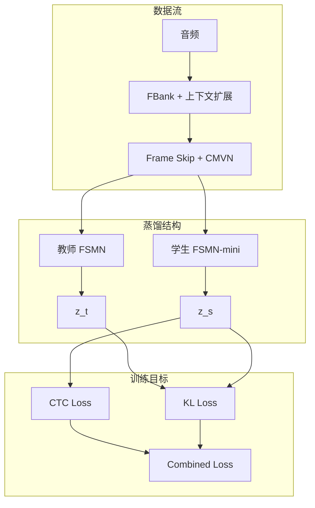

# hi_xiaowen 压缩路线阶段总结（baseline2599 -> weight surgery -> distillation）

## 1. 背景与目标

- 基线模型：`fsmn_ctc_baseline_4gpus`，Head=2599，参数约 `756K`。
- 已验证事实：通过输出层权重手术（weight surgery）裁剪 Head，可以在几乎不损失精度的前提下显著减参。
- 当前目标：在保持唤醒精度（FAR/FRR）可用的前提下，把模型继续压缩到 `~135K` 量级，并形成可落地的最终方案。

## 2. 已尝试方案与结果

## 2.1 第一步：Head 440 / Head top hot words 的权重手术

### 2.1.1 baseline2599 -> top20_weight_surgery（已验证有效）

- 实验：`examples/hi_xiaowen/s0/exp/fsmn_ctc_top20_weight_surgery/test_79`
- 对照：`examples/hi_xiaowen/s0/exp/fsmn_ctc_baseline_4gpus/test_79`
- 结论（来自 `docs/hi_xiaowen_top2598_analysis.md`）：

| 方案 | 关键词 | Accuracy | FRR | FAR(/h) | 参数量 |
|---|---|---:|---:|---:|---:|
| baseline_4gpus | 嗨小问 | 98.38% | 1.62% | 0.64 | 756K |
| baseline_4gpus | 你好问问 | 98.05% | 1.95% | 0.28 | 756K |
| top20_weight_surgery | 嗨小问 | 98.88% | 1.12% | 0.67 | 392K |
| top20_weight_surgery | 你好问问 | 98.63% | 1.37% | 0.32 | 392K |

- 参数变化：`756K -> 392K`（约 `-48.1%`）。
- 说明：这一步证明“只裁剪 Head + 权重手术”可以显著减参且精度几乎不降。

### 2.1.2 top440_weight_surgery（作为后续蒸馏教师候选）

- 实验：`examples/hi_xiaowen/s0/exp/fsmn_ctc_top440_weight_surgery/test_24`
- 观测（threshold=0.000）：
  - 嗨小问：FAR `0.6995/h`，FRR `1.5976%`
  - 你好问问：FAR `0.1752/h`，FRR `2.5749%`
- `score.txt` 前几条分数接近 `1.000`，作为蒸馏教师有更高 logit margin。

## 2.2 第二步（进行中）：top20 教师蒸馏一个更小学生（~135K）

- 当前学生实验：`examples/hi_xiaowen/s0/exp/fsmn_ctc_distill_mini/test_26`
- 学生结构来源：`docs/plan/fsmn知识蒸馏实现_fab1b24d.plan.md`
  - 学生约 `~138K`（可近似按 `~135K` 理解）
- 当前现象：整体精度不理想，存在明显失衡。

### 当前观测数据

- 教师（top20 surgery）分数样例：`examples/hi_xiaowen/s0/exp/fsmn_ctc_top20_weight_surgery/test_79/score.txt`
  - 前几条约 `0.62~0.78`（当前文件首条是 `0.648`）。
- 学生（distill_mini）分数样例：`examples/hi_xiaowen/s0/exp/fsmn_ctc_distill_mini/test_26/score.txt`
  - 前几条约 `0.40~0.43`，低于教师。
- `test_26`（threshold=0.000）:
  - 嗨小问：FAR `93.9545/h`，FRR `0.1973%`
  - 你好问问：FAR `0.2920/h`，FRR `54.3182%`

结论：当前 `top20 -> mini` 蒸馏在两关键词上的判别能力不平衡，暂未达到可部署状态。

## 3. 复用架构图（来自 docs/plan）

公式：`L = lambda * CTC + (1-lambda) * T^2 * KL`。

## 4. 待尝试方案（含预期精度与预期模型大小）

## 4.1 方案 A（当前主线）

`HEAD 440 教师（先训满 80 epoch） -> 蒸馏 HEAD 440 学生 -> 权重手术裁到 HEAD 20`

- 依据：
  - `top440_weight_surgery` 当前分数更尖锐（接近 1.0），有利于 KD。
  - 你已验证权重手术本身有效。
- 参考参数量（来自 `docs/plan/top440蒸馏+教师权重初始化_7f47ccd8.plan.md`）：
  - 教师（440）：约 `451K`
  - 学生（440 mini）：约 `176K`
  - 学生再 surgery 到 20：约 `136K`
- 预期精度（工程目标值）：
  - 440 学生蒸馏后：目标接近 440 教师，建议目标 `FRR < 5%`、`FAR <= 1/h`
  - surgery 到 20 后最终模型：相对 440 学生允许轻微回退，建议目标 `FRR < 8%`、`FAR <= 1/h`

## 4.2 方案 B（A 失败时的兜底主线）

`baseline HEAD 2599 教师 -> HEAD 2599 学生蒸馏 -> 对学生做 surgery 到 HEAD 20`

- 动机：
  - 如果 440 路线仍不稳，则先在更大输出空间完成蒸馏，再做裁剪。
- 预期模型大小（估算）：
  - 若继续使用 mini backbone，2599-head 学生约 `~386K`（`~134K backbone + ~252K head`）
  - surgery 到 20 后约 `~136K`
- 预期精度：
  - 2599 学生阶段应先达到“接近 baseline”的 FAR/FRR；
  - surgery 后目标至少回到当前 top20 surgery 的同量级（接近 `392K` 教师表现）。

## 4.3 方案 C（保底）

`采用徐博已验证的更轻量 backbone -> 从其 HEAD2599 做 surgery 到 HEAD20`

- 动机：已有跨数据集轻量化 backbone 经验，可作为工程保底路径。
- 当前仓库状态：尚未在 `docs/` 与 `examples/hi_xiaowen/s0/exp` 中定位到可直接复用的该实验完整指标文件（需补充具体实验目录/日志）。
- 预期模型大小：取决于徐博 backbone 本体，最终模型约等于
  - `backbone_params + (output_affine_dim * 20 + 20)`
- 预期精度：以“优先可部署”为目标，先满足业务阈值，再继续蒸馏优化。

## 5. 阶段结论

- 已完成并被证明有效：`baseline2599 -> head surgery`（`756K -> ~390K`）且精度基本不降。
- 正在攻克的问题：`top20 教师 -> ~135K 学生`蒸馏精度不稳定。
- 下一步最合理路径：先做 `top440` 教师与 `top440` 学生蒸馏，再利用已验证的权重手术落到 `HEAD20` 最终小模型。
